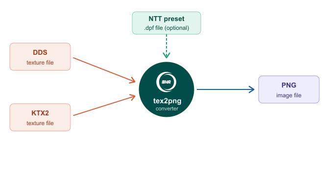
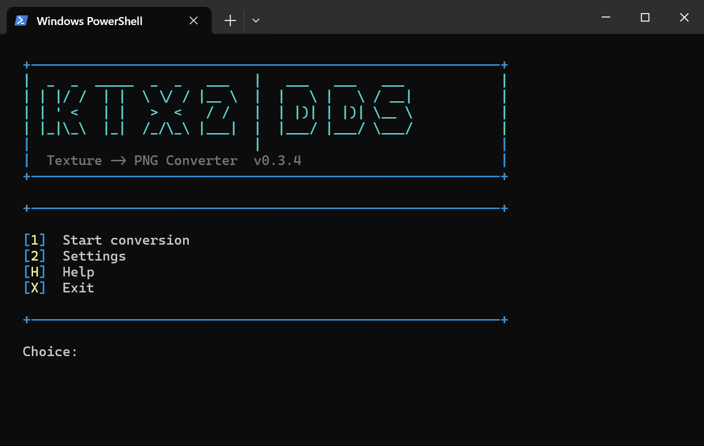
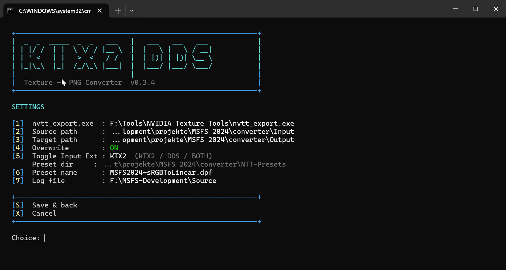
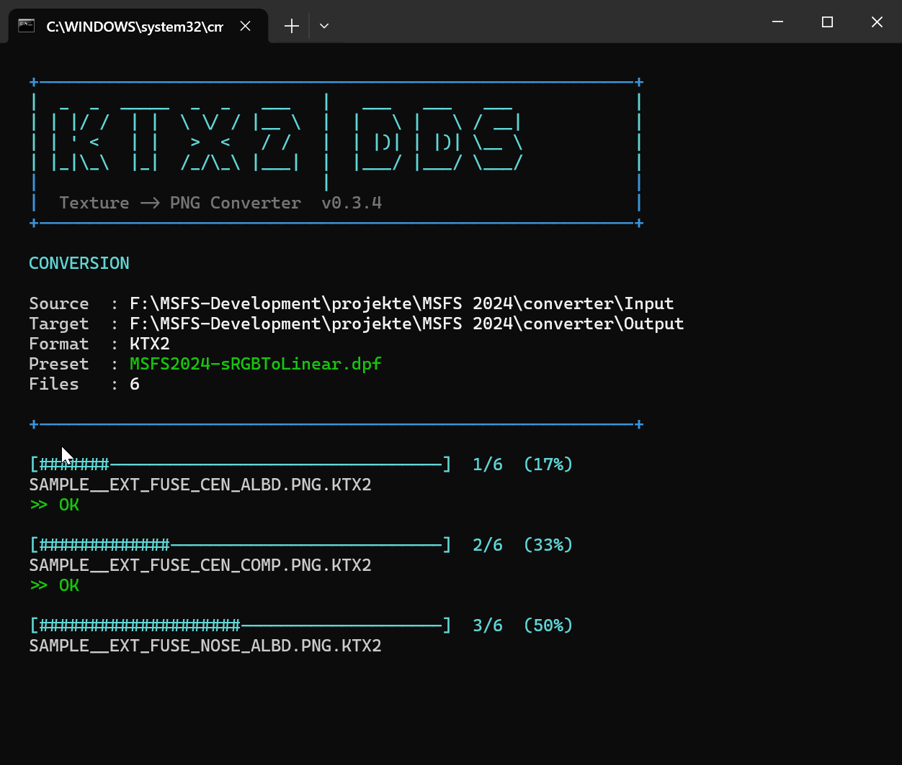

# tex2png — Texture to PNG Converter
### User Guide &nbsp;·&nbsp; v0.3.4

---

## Overview

**tex2png** is a PowerShell-based batch converter that extracts DDS and KTX2 texture files into standard PNG images for editing in Photoshop, GIMP, or any other image editor.

The tool uses **NVIDIA Texture Tools Exporter** (`nvtt_export.exe`) as its conversion engine and supports optional NTT preset files to control color space handling during export.

> **Important:** KTX2 albedo textures are typically stored in sRGB color space. To get correct colors when extracting, use the **sRGB to Linear** effect in an NTT preset — see [NTT Presets](#ntt-presets).
---










## Requirements

- Windows 10 or 11
- PowerShell 5.1 or later (included with Windows)
- NVIDIA Texture Tools Exporter 2024.1.1 or later
  - Download free from: [developer.nvidia.com/texture-tools-exporter](https://developer.nvidia.com/texture-tools-exporter)

---

## Installation

### 1. Extract the package

Extract the complete ZIP file into any folder on your system. All required files including the `NTT-Presets` folder and presets are included.

### 2. Allow script execution

Open PowerShell as Administrator and run:

```powershell
Set-ExecutionPolicy -ExecutionPolicy RemoteSigned -Scope CurrentUser
```

### 3. Create a start.bat (optional)

For easy launching, create a `start.bat` file next to the script:

```bat
@echo off
powershell -ExecutionPolicy Bypass -File "%~dp0tex2png.ps1"
```

---

## Settings

All settings are accessible from the main menu under **[2] Settings** and saved to `userConfig.ini` next to the script.

| # | Setting | Description |
|---|---------|-------------|
| 1 | **nvtt_export.exe path** | Full path to `nvtt_export.exe` or its parent folder. The filename is appended automatically if omitted. |
| 2 | **Source path** | Folder containing the KTX2 or DDS texture files to convert. |
| 3 | **Target path** | Folder where exported PNG files will be saved. |
| 4 | **Overwrite** | `ON`: existing PNG files are overwritten. `OFF`: existing PNG files are skipped. |
| 5 | **Input format** | Cycles between `KTX2`, `DDS`, and `BOTH`. Determines which file types are picked up from the source folder. |
| 6 | **Preset name** | Filename of the NTT preset to apply during conversion (e.g. `MSFS2024-sRGBToLinear.dpf`). Must be placed in the `NTT-Presets` folder next to the script. |
| 7 | **Log file** | Path to the log file. Defaults to `logfile.txt` next to the script. |

> **Tip:** Invalid paths entered in Settings are shown in red and not saved to the INI file. After 2 failed entries the tool will suggest pressing **[H]** for help.

---

## NTT Presets

tex2png supports NTT preset files (`.dpf`) to apply specific conversion settings to every texture. The preset folder is fixed at:

```
<script folder>\NTT-Presets\
```

The folder and the two default presets are included in the package. Simply unzip and the presets are ready to use.

| Preset file | Purpose |
|-------------|---------|
| `default.dpf` | NTT standard settings, no color space conversion |
| `MSFS2024-sRGBToLinear.dpf` | Applies sRGB to Linear conversion — recommended for sRGB albedo textures |

The tool will warn on startup if the `NTT-Presets` folder is missing or if no preset is selected.

### Creating a preset

1. Open **NVIDIA Texture Tools Exporter**
2. Configure the desired settings (e.g. add the **sRGB to Linear** effect for sRGB albedo textures)
3. Click **Save Preset** and save the `.dpf` file
4. Drop the `.dpf` file into the `NTT-Presets` folder
5. Set the preset name in Settings **[6]** to match the filename

> **Tip:** Use [Tacent View](https://github.com/bluescan/tacentview) (free) to verify texture colors after conversion. NTT's own preview can display colors incorrectly without the sRGB to Linear effect applied.

---

## File Structure

After first run, the following files exist next to `tex2png.ps1`:

```
tex2png.ps1                   ← the main script
userConfig.ini                ← saved settings (auto-generated on first run)
logfile.txt                   ← conversion log with timestamps
NTT-Presets\                  ← included in the package
    default.dpf
    MSFS2024-sRGBToLinear.dpf
start.bat                     ← launcher
```

---

## Quick Start

1. Run `start.bat` or launch `tex2png.ps1` from PowerShell
2. Press **[2]** to open Settings
3. Set the path to `nvtt_export.exe` — **[1]**
4. Set the source folder containing your textures — **[2]**
5. Set the target folder for the PNG output — **[3]**
6. Choose the input format (KTX2 / DDS / BOTH) — **[5]**
7. Set the preset name — **[6]** (e.g. `MSFS2024-sRGBToLinear.dpf`)
8. Press **[S]** to save, then **[X]** to return to the main menu
9. Press **[1]** to start the conversion

---

## Notes

- All texture files of the selected format in the source folder are processed
- The conversion log records every file processed including errors and skip reasons
- The `NTT-Presets` folder and both default presets ship with the package — no manual setup required
- The preset folder path is fixed and cannot be changed in Settings

---

*tex2png is a community tool for the conversion of textures from the DDS or KTX2 to PNG format. Not affiliated with Microsoft, Asobo Studio, or NVIDIA.*

## Using this script
 
You're welcome to download it, run it, fork it, and adapt it for your own needs. That's what it's here for. If it helps you out, great — that's the whole point.
 
## A note on contributions
 
I'm maintaining this solo and in my spare time, so I'm keeping things simple:
 
- **Pull requests:** I'm not actively reviewing or merging outside contributions right now. You're very welcome to fork the project and build on it in your own copy.
- **Issues:** Feel free to open one if something's broken — I'll take a look when I can, but I can't promise a timeline.
- **Direct changes:** Only I push to this repo. Nothing gets merged without my say-so.
None of this is meant unkindly — I just want to keep the maintenance light so this stays something I enjoy doing. Thanks for understanding, and I hope the script is useful to you.

## ⚠️ Disclaimer

These scripts are provided **free of charge and "as is", without any warranty
of any kind**. Use them at your own risk. The author accepts no responsibility
or liability for any data loss, file corruption, hardware issues, or other
damages arising from the use or misuse of this software.

Always back up your files before running any script. By using this software you
agree that you do so entirely at your own risk.

Licensed under the [MIT License](LICENSE).